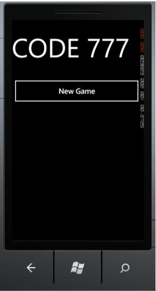
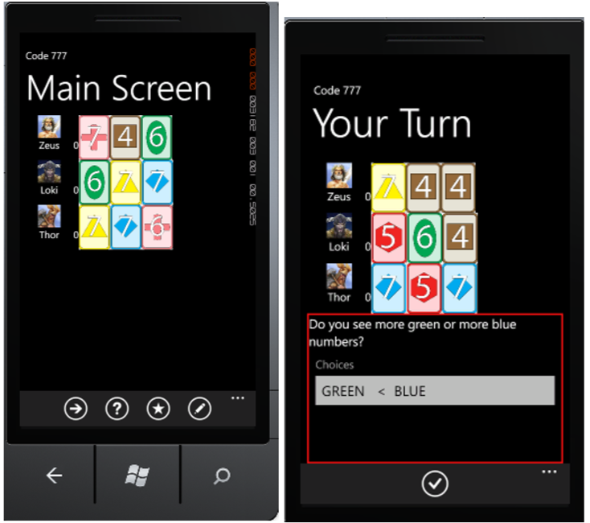
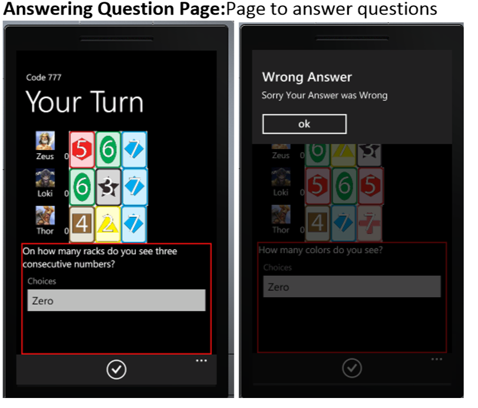
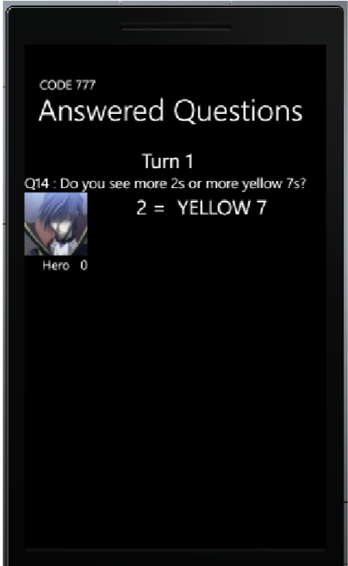
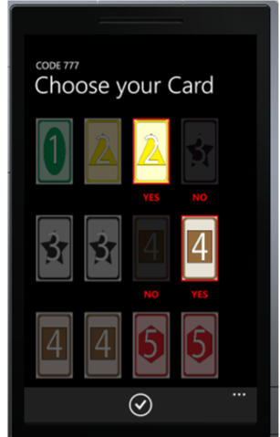
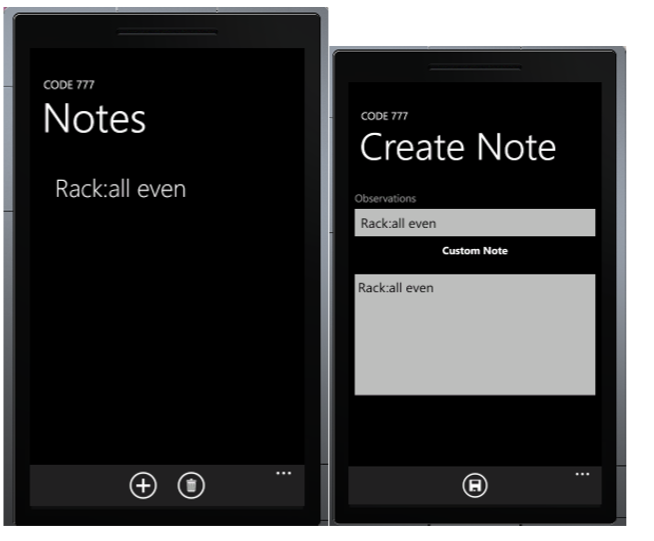

## Game Info: ##

Code 777 is a logic deduction game created by Robert Abbott and Alex Randolph. 

The games is played from 2-4 players. Each player is given a rack with 3 cards (a card has a color and a number). The player's own cards are not visible to them but to their opponent. Each turn, a player takes a question from the deck. A question might be like (on how many racks are there green cards?). 

## Prerequisites for running project ##

- Visual Studio 2010 and above 
- Windows phone 7.5 and above
- [Mvvm toolkit](http://mvvmlight.codeplex.com/)

## Screenshots ##
**Start Screen** 

When app is opened. Press New game to start

**Main Screen**
 
After New Game, this screen shows the players, their cards.
When a question is answered, it show on the bottom. The page also has white buttons on the bottom corresponding to other screens 

**Answering Question Page**
 
Page to answer questions

**Questions Answered Page**
 
List of questions answered   

**Guess Cards Page**
 
Page where you can guess card. If you have three cards with state yes, then if you press the guess button, the program will check your guess 

**Notes Page** 

Button to create and delete Note. Click the create note, will take you to a page to select note.
  